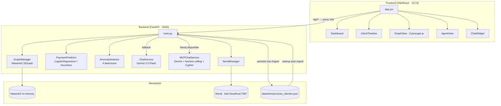

# Analizador de Patrones de Llamadas

> Plataforma de analytics para cobranza de deudas. Ingiere datos JSON de clientes e interacciones, construye un grafo de conocimiento en memoria (NetworkX) y opcionalmente en disco (Neo4j), y sirve un dashboard React con gráficos, timelines, visualización de grafos y un asistente de chat potenciado por Gemini.

---

## Arquitectura general



**Capa dual de almacenamiento:**
- **NetworkX** (in-memory): todas las consultas analíticas y el servicio de predicción y anomalías. Se reconstruye en RAM en cada arranque desde el JSON.
- **Neo4j** (opcional, persistente): permite consultas Cypher y habilita el modo `MCPChatService` donde el LLM ejecuta Cypher directamente.

---

## Estructura del proyecto

```
PruebaTecnica/
├── backend/
│   ├── main.py                  # App FastAPI, singletons, todos los endpoints
│   ├── graph_manager.py         # Grafo NetworkX, ingesta, métricas, consultas
│   ├── prediction_service.py    # Predicción de pagos (LogisticRegression / heurística)
│   ├── anomaly_detector.py      # Detección de anomalías (4 detectores)
│   ├── chat_service.py          # Chat Gemini con contexto serializado
│   ├── mcp_chat_service.py      # Chat Gemini con function calling sobre Neo4j
│   ├── neo4j_manager.py         # Persistencia y consultas Cypher en Neo4j
│   ├── requirements.txt
│   └── .env                     # Variables de entorno (no incluir en control de versiones)
├── frontend/
│   ├── src/
│   │   ├── App.jsx              # Raíz: LandingPage → layout con 4 tabs
│   │   ├── services/api.js      # Todas las llamadas axios (baseURL: /api)
│   │   └── components/
│   │       ├── Dashboard.jsx    # KPIs y gráficos Chart.js
│   │       ├── ClientTimeline.jsx
│   │       ├── GraphView.jsx    # Cytoscape.js + fcose layout
│   │       ├── AgentView.jsx
│   │       ├── ChatWidget.jsx   # Panel flotante de chat
│   │       ├── LandingPage.jsx  # Upload inicial del JSON
│   │       └── ThemeToggle.jsx
│   └── vite.config.js           # Proxy /api/* → localhost:8000
├── data/
│   └── interacciones_clientes.json   # Persistido tras el primer ingest
├── start_backend.bat
└── start_frontend.bat
```

---

## Instalación

### Requisitos previos

- Python 3.10+
- Node.js 18+
- (Opcional) Neo4j Desktop o Neo4j Community

### Backend

```bash
cd backend
pip install -r requirements.txt
```

### Frontend

```bash
cd frontend
npm install
```

---

## Variables de entorno

Archivo: `backend/.env`

| Variable | Requerida | Descripción |
|---|---|---|
| `GEMINI_API_KEY` | Sí | Clave de API de Google Gemini. Sin ella, `/chat` no funciona |
| `NEO4J_URI` | No | URI del servidor Neo4j (default: `bolt://localhost:7687`) |
| `NEO4J_USER` | No | Usuario Neo4j (default: `neo4j`) |
| `NEO4J_PASSWORD` | No | Contraseña Neo4j. Si está vacía, el sistema opera solo con NetworkX y `MCPChatService` no se activa |

Ejemplo de contenido:

```
GEMINI_API_KEY=AIzaSy...
NEO4J_URI=bolt://localhost:7687
NEO4J_USER=neo4j
NEO4J_PASSWORD=miPassword
```

---

## Ejecución

### Con scripts `.bat` (Windows)

```
start_backend.bat      # Terminal 1
start_frontend.bat     # Terminal 2
```

### Manual

```bash
# Terminal 1 — backend
cd backend
uvicorn main:app --reload --port 8000

# Terminal 2 — frontend
cd frontend
npm run dev
```

La aplicación queda disponible en `http://localhost:5173`.  
Documentación interactiva de la API: `http://localhost:8000/docs`

---

## Flujo de datos

```
Archivo JSON  ──►  POST /ingest  ──►  GraphManager.reset() + ingest()
                                          │
                          ┌───────────────┼───────────────┐
                          ▼               ▼               ▼
                  _compute_promise  _compute_client  _compute_agent
                  _fulfillment()    _metrics()       _metrics()
                                          │
                          ┌───────────────┼
                          ▼               ▼
                  PaymentPredictor  Neo4jManager.ingest()
                  .train(gm)        (si conectado)
```

Al arrancar el servidor, si `data/interacciones_clientes.json` existe y contiene datos válidos, el backend ejecuta automáticamente este flujo sin necesidad de un `POST /ingest`.

---

## Formato de datos de entrada

```json
{
  "clientes": [
    {
      "id": "CLI-001",
      "nombre": "Juan Pérez",
      "telefono": "507-6000-0001",
      "monto_deuda_inicial": 1500.00,
      "fecha_prestamo": "2024-01-15",
      "tipo_deuda": "personal"
    }
  ],
  "interacciones": [
    {
      "id": "INT-001",
      "cliente_id": "CLI-001",
      "tipo": "llamada_saliente",
      "timestamp": "2025-07-01T09:30:00Z",
      "agente_id": "AGT-01",
      "duracion_segundos": 120,
      "resultado": "promesa_pago",
      "sentimiento": "neutral",
      "monto_prometido": 300.00,
      "fecha_promesa": "2025-07-15"
    }
  ]
}
```

### Valores de `tipo` de interacción

| Valor | Descripción |
|---|---|
| `llamada_saliente` | Llamada originada por el agente |
| `llamada_entrante` | Llamada recibida del cliente |
| `pago_recibido` | Registro de pago (requiere `monto`, `metodo_pago`, `pago_completo`) |
| `email` | Contacto por correo electrónico |
| `sms` | Contacto por mensaje de texto |

### Valores de `resultado` (solo llamadas)

| Valor | Efecto en el sistema |
|---|---|
| `pago_inmediato` | +5 al risk score del cliente |
| `promesa_pago` | Crea nodo `PromesaPago` (requiere `monto_prometido`, `fecha_promesa`) |
| `renegociacion` | Crea nodo `Interaccion` con campos `cuotas` y `monto_mensual` si hay `nuevo_plan_pago` |
| `se_niega_pagar` | −8 al risk score |
| `disputa` | −5 al risk score |
| `sin_respuesta` | Sin ajuste al risk score |

### Valores de `sentimiento` (solo llamadas)

`positivo`, `neutral`, `hostil`  
Más de 2 interacciones `hostil` restan −10 al risk score del cliente.

---

## Modelo del grafo de conocimiento

### Nodos

| Tipo | Propiedades clave |
|---|---|
| `cliente` | `id`, `nombre`, `telefono`, `monto_deuda_inicial`, `tipo_deuda`, `risk_score`, `estado`, `total_pagado`, `monto_pendiente`, `tasa_recuperacion` |
| `agente` | `id`, `total_contactos`, `pagos_inmediatos`, `promesas_generadas`, `renegociaciones`, `se_niega`, `disputas`, `sin_respuesta` |
| `deuda` | `monto_inicial`, `tipo`, `fecha_prestamo` |
| `interaccion` | `id`, `tipo`, `timestamp`, `resultado`, `sentimiento`, `duracion_segundos`, `agente_id` |
| `pago` | `id`, `monto`, `timestamp`, `metodo_pago`, `pago_completo` |
| `promesa` | `id`, `monto_prometido`, `fecha_promesa`, `cumplida`, `vencida` |
| `contacto` | `id`, `tipo` (`email`/`sms`), `timestamp` |

### Relaciones

```
(cliente)     -[:TIENE_DEUDA]--------► (deuda)
(cliente)     -[:TUVO_INTERACCION]--► (interaccion)
(cliente)     -[:REALIZA]-----------► (pago)
(cliente)     -[:PROMETE]----------► (promesa)
(cliente)     -[:TUVO_CONTACTO]----► (contacto)
(interaccion) -[:ATENDIDA_POR]-----► (agente)
(interaccion) -[:GENERA]------------► (promesa)
(promesa)     -[:SE_CUMPLE_CON]----► (pago)
```

### Risk score (0–100)

Base 50, calculado una sola vez en `_compute_client_metrics()` durante la ingesta:

| Evento | Ajuste |
|---|---|
| Pago inmediato | +5 por cada uno |
| Negativa a pagar | −8 por cada una |
| Disputa | −5 por cada una |
| Tasa de promesas cumplidas | `(cumplidas/hechas) * 20 − 10` |
| Recuperación total | `(pagado/deuda_inicial) * 15` (máx. 1.0) |
| >2 interacciones hostiles | −10 |

Clasificación de riesgo: `alto` < 35 · `medio` 35–64 · `bajo` >= 65

---

## Endpoints REST

### Salud

| Método | Ruta | Descripción |
|---|---|---|
| `GET` | `/` | Estado del servidor, conteos cargados y estadísticas de Neo4j |

### Datos

| Método | Ruta | Descripción |
|---|---|---|
| `POST` | `/ingest` | Recibe JSON con `clientes` e `interacciones`, persiste en disco y reconstruye ambos grafos |

### Chat

| Método | Ruta | Body | Descripción |
|---|---|---|---|
| `POST` | `/chat` | `{ "message": "...", "history": [] }` | Consulta en lenguaje natural. Retorna `source: "mcp_cypher"` o `"context_serialized"` según el servicio activo |

### Clientes

| Método | Ruta | Descripción |
|---|---|---|
| `GET` | `/clientes` | Lista todos los clientes con métricas calculadas |
| `GET` | `/clientes/{id}` | Datos de un cliente |
| `GET` | `/clientes/{id}/timeline` | Eventos, pagos, promesas y evolución de deuda del cliente |
| `GET` | `/clientes/{id}/prediccion` | Probabilidad de pago en los próximos 7 días |

### Agentes

| Método | Ruta | Descripción |
|---|---|---|
| `GET` | `/agentes` | Lista todos los agentes ordenados por `total_contactos` |
| `GET` | `/agentes/{id}/efectividad` | Métricas detalladas: actividad por día, desglose de resultados |

### Analytics

| Método | Ruta | Params opcionales | Descripción |
|---|---|---|---|
| `GET` | `/analytics/dashboard` | — | KPIs globales: recuperación, riesgo, actividad por día |
| `GET` | `/analytics/promesas-incumplidas` | — | Promesas vencidas y no cumplidas |
| `GET` | `/analytics/mejores-horarios` | — | Tasa de éxito por hora del día |
| `GET` | `/analytics/anomalias` | `tipo`, `umbral_promesas_rotas` (default 3), `dias_inactividad` (default 7), `umbral_disputas_factor` (default 3.0) | Anomalías detectadas |

### Grafo

| Método | Ruta | Params opcionales | Descripción |
|---|---|---|---|
| `GET` | `/graph/data` | `cliente_id`, `agente_id` | Nodos y aristas en formato Cytoscape.js. Con `cliente_id` retorna ego-grafo de radio 2. Sin parámetros retorna solo clientes y agentes con aristas de peso |

---

## Dependencias

### Backend (`backend/requirements.txt`)

| Paquete | Versión | Uso |
|---|---|---|
| `fastapi` | 0.115.0 | Framework HTTP |
| `uvicorn[standard]` | 0.30.0 | Servidor ASGI |
| `networkx` | 3.3 | Grafo en memoria |
| `pydantic` | 2.7.0 | Validación de modelos de entrada |
| `google-genai` | >=1.0.0 | SDK de Gemini (ChatService y MCPChatService) |
| `python-dotenv` | >=1.0.0 | Carga de variables de entorno desde `.env` |
| `neo4j` | >=5.20.0 | Driver async para Neo4j (opcional) |
| `scikit-learn` | >=1.4.0 | `LogisticRegression` para predicción de pagos |
| `python-multipart` | 0.0.9 | Soporte de formularios en FastAPI |

### Frontend

| Paquete | Uso |
|---|---|
| React 18 + Vite 5 | Framework UI y build tool |
| Chart.js | Gráficos en Dashboard |
| Cytoscape.js + cytoscape-fcose | Visualización del grafo con layout fcose |
| framer-motion | Animaciones de transición entre tabs (`AnimatePresence`) |
| axios | Llamadas HTTP al backend |
