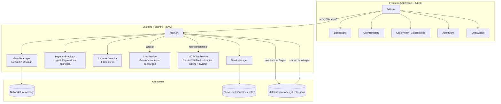
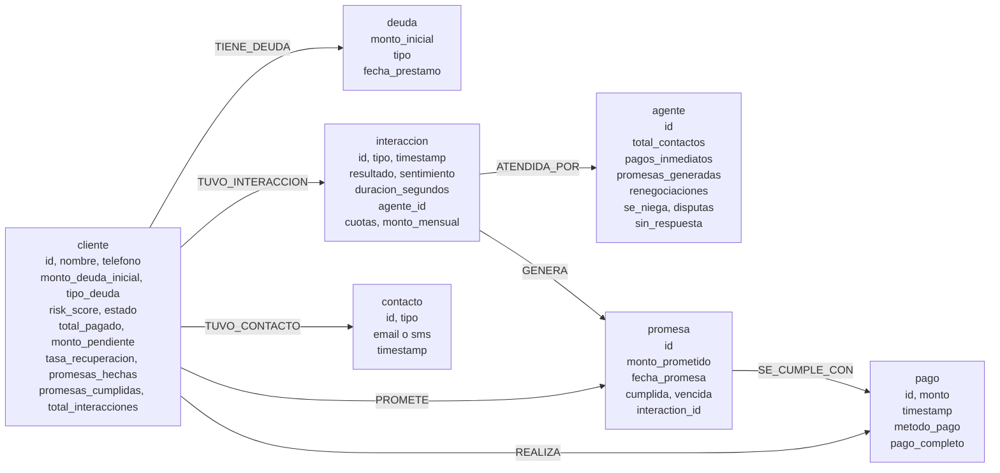

# Analizador de Patrones de Llamadas

> Plataforma de analytics para cobranza de deudas. Ingiere datos JSON de clientes e interacciones, construye un grafo de conocimiento en memoria (NetworkX) y opcionalmente en disco (Neo4j), y sirve un dashboard React con gráficos, timelines, visualización de grafos y un asistente de chat potenciado por Gemini.

---

## Descripción de la solución

### Problema que resuelve

Los equipos de cobranza trabajan con carteras de decenas o cientos de deudores sin visibilidad unificada sobre el historial de contactos, el comportamiento de pago ni la efectividad individual de cada agente. Las decisiones se toman a ciegas, sin saber qué clientes tienen mayor probabilidad de pagar esta semana, qué agentes generan más disputas o qué promesas están vencidas.

### Valor que aporta

- **Dashboard operativo**: KPIs globales de recuperación, distribución de riesgo, actividad por día y desglose de resultados de interacciones.
- **Timelines por cliente**: cronología completa de contactos, pagos y promesas con evolución de la deuda.
- **Predicción de pago**: probabilidad estimada de que un cliente pague en los próximos 7 días, con factores explicativos.
- **Detección de anomalías**: alertas automáticas sobre agentes con disputas inusuales, clientes con promesas rotas consecutivas, agentes inactivos y clientes con pagos decrecientes.
- **Chat analítico en lenguaje natural**: el equipo puede hacer preguntas sobre la cartera sin necesidad de escribir consultas.
- **Visualización de grafo**: red de relaciones entre clientes, agentes, interacciones, pagos y promesas navegable en el navegador.

### Tecnologías principales y por qué

| Capa | Tecnología | Razón |
|---|---|---|
| Backend | FastAPI | Async nativo, tipado con Pydantic, documentación automática en `/docs` |
| Grafo en memoria | NetworkX `DiGraph` | Reconstrucción en RAM en cada arranque; permite ego-grafos, travesías y consultas analíticas sin latencia de red |
| Grafo persistente | Neo4j (opcional) | Almacenamiento durable y Cypher para el asistente de chat con function calling |
| Chat LLM | Gemini 2.5 Flash (MCPChatService) | Function calling nativo permite al modelo ejecutar Cypher real en lugar de consumir texto serializado |
| Predicción | scikit-learn `LogisticRegression` | Modelo lineal interpretable con fallback heurístico cuando hay pocos datos positivos |
| Detección de anomalías | Heurísticas estadísticas | Cuatro detectores independientes sin dependencia de bibliotecas externas de ML |
| Frontend | React 18 + Vite 5 | SPA con HMR rápido; sin framework CSS pesado |
| Visualización de grafo | Cytoscape.js + fcose | Único motor de grafos con layout force-directed de alta calidad para grafos densos en el navegador |
| Gráficos | Chart.js | Ligero, sin overhead de D3 para los casos de uso de dashboard |
| Animaciones | framer-motion | `AnimatePresence` para transiciones de tabs sin código manual de CSS |

---

## Arquitectura general



**Capa dual de almacenamiento:**
- **NetworkX** (in-memory): todas las consultas analíticas, predicción y anomalías. Se reconstruye en RAM en cada arranque desde el JSON.
- **Neo4j** (opcional, persistente): permite consultas Cypher y habilita el modo `MCPChatService` donde el LLM ejecuta Cypher directamente sobre datos reales.

---

## Estructura del proyecto

```
PruebaTecnica/
├── backend/
│   ├── main.py                  # App FastAPI, singletons, todos los endpoints
│   ├── graph_manager.py         # Grafo NetworkX, ingesta, métricas, consultas
│   ├── prediction_service.py    # Predicción de pagos (LogisticRegression / heurística)
│   ├── anomaly_detector.py      # Detección de anomalías (4 detectores)
│   ├── chat_service.py          # Chat Gemini con contexto serializado (fallback)
│   ├── mcp_chat_service.py      # Chat Gemini con function calling sobre Neo4j
│   ├── neo4j_manager.py         # Persistencia y consultas Cypher en Neo4j
│   ├── requirements.txt
│   └── .env                     # Variables de entorno (no incluir en control de versiones)
├── frontend/
│   ├── src/
│   │   ├── App.jsx              # Raíz: LandingPage → layout con 4 tabs
│   │   ├── services/api.js      # Todas las llamadas axios (baseURL: /api)
│   │   └── components/
│   │       ├── Dashboard.jsx    # KPIs y gráficos Chart.js
│   │       ├── ClientTimeline.jsx
│   │       ├── GraphView.jsx    # Cytoscape.js + fcose layout
│   │       ├── AgentView.jsx
│   │       ├── ChatWidget.jsx   # Panel flotante de chat
│   │       ├── LandingPage.jsx  # Upload inicial del JSON
│   │       └── ThemeToggle.jsx
│   └── vite.config.js           # Proxy /api/* → localhost:8000
├── data/
│   └── interacciones_clientes.json   # Persistido tras el primer ingest
├── start_backend.bat
└── start_frontend.bat
```

---

## Instalación paso a paso

### Requisitos previos

| Requisito | Versión mínima | Notas |
|---|---|---|
| Python | 3.10+ | Necesario para el backend |
| Node.js | 18+ | Necesario para el frontend |
| Neo4j Desktop / Community | 5.x | **Opcional.** Sin él, el sistema funciona con NetworkX y `ChatService` estándar |

### 1. Clonar el repositorio

```bash
git clone <url-del-repositorio>
cd PruebaTecnica
```

### 2. Configurar variables de entorno

Crear el archivo `backend/.env`:

```
GEMINI_API_KEY=AIzaSy...
NEO4J_URI=bolt://localhost:7687
NEO4J_USER=neo4j
NEO4J_PASSWORD=miPassword
```

| Variable | Requerida | Descripción |
|---|---|---|
| `GEMINI_API_KEY` | Sí | Clave de API de Google Gemini. Sin ella, `/chat` no funciona |
| `NEO4J_URI` | No | URI del servidor Neo4j (default: `bolt://localhost:7687`) |
| `NEO4J_USER` | No | Usuario Neo4j (default: `neo4j`) |
| `NEO4J_PASSWORD` | No | Contraseña Neo4j. Si está vacía, el sistema opera solo con NetworkX y `MCPChatService` no se activa |

> Si no tienes Neo4j, omite las tres variables `NEO4J_*`. El sistema arranca y funciona completamente en modo NetworkX.

### 3. Instalar dependencias del backend

```bash
cd backend
pip install -r requirements.txt
```

### 4. Instalar dependencias del frontend

```bash
cd frontend
npm install
```

---

## Cómo ejecutar el proyecto

### Con scripts `.bat` (Windows)

Abrir dos terminales y ejecutar:

```
start_backend.bat      # Terminal 1
start_frontend.bat     # Terminal 2
```

### Manual

```bash
# Terminal 1 — backend
cd backend
uvicorn main:app --reload --port 8000

# Terminal 2 — frontend
cd frontend
npm run dev
```

### URLs de acceso

| URL | Descripción |
|---|---|
| `http://localhost:5173` | Interfaz React |
| `http://localhost:8000/docs` | Documentación interactiva Swagger |
| `http://localhost:8000` | Estado del servidor (JSON) |

### Primer arranque sin datos

Si no existe `data/interacciones_clientes.json`, el frontend muestra la pantalla de `LandingPage`. Desde ahí se puede subir el archivo JSON directamente desde el navegador. El backend lo persiste en disco y reconstruye ambos grafos.

Si el archivo existe y contiene los arrays `clientes` e `interacciones`, el backend lo ingesta automáticamente en el evento `startup` sin necesidad de intervención.

---

## Flujo de datos

```
Archivo JSON  ──►  POST /ingest  ──►  GraphManager.reset() + ingest()
                                          │
                          ┌───────────────┼───────────────┐
                          ▼               ▼               ▼
                  _compute_promise  _compute_client  _compute_agent
                  _fulfillment()    _metrics()       _metrics()
                                          │
                          ┌───────────────┼
                          ▼               ▼
                  PaymentPredictor  Neo4jManager.ingest()
                  .train(gm)        (si conectado)
```

Las interacciones se ordenan por `timestamp` antes de la ingesta para que el procesamiento de cumplimiento de promesas sea cronológicamente consistente.

---

## Formato de datos de entrada

```json
{
  "clientes": [
    {
      "id": "CLI-001",
      "nombre": "Juan Pérez",
      "telefono": "507-6000-0001",
      "monto_deuda_inicial": 1500.00,
      "fecha_prestamo": "2024-01-15",
      "tipo_deuda": "personal"
    }
  ],
  "interacciones": [
    {
      "id": "INT-001",
      "cliente_id": "CLI-001",
      "tipo": "llamada_saliente",
      "timestamp": "2025-07-01T09:30:00Z",
      "agente_id": "AGT-01",
      "duracion_segundos": 120,
      "resultado": "promesa_pago",
      "sentimiento": "neutral",
      "monto_prometido": 300.00,
      "fecha_promesa": "2025-07-15"
    }
  ]
}
```

### Valores de `tipo` de interacción

| Valor | Descripción |
|---|---|
| `llamada_saliente` | Llamada originada por el agente |
| `llamada_entrante` | Llamada recibida del cliente |
| `pago_recibido` | Registro de pago (requiere `monto`, `metodo_pago`, `pago_completo`) |
| `email` | Contacto por correo electrónico |
| `sms` | Contacto por mensaje de texto |

### Valores de `resultado` (solo llamadas)

| Valor | Efecto en el sistema |
|---|---|
| `pago_inmediato` | +5 al risk score del cliente |
| `promesa_pago` | Crea nodo `PromesaPago` (requiere `monto_prometido`, `fecha_promesa`) |
| `renegociacion` | Registra `cuotas` y `monto_mensual` si hay `nuevo_plan_pago` |
| `se_niega_pagar` | −8 al risk score |
| `disputa` | −5 al risk score |
| `sin_respuesta` | Sin ajuste al risk score |

### Valores de `sentimiento` (solo llamadas)

`positivo`, `neutral`, `hostil` — más de 2 interacciones `hostil` restan −10 al risk score.

---

## Esquema del modelo de grafo

### Diagrama de nodos y relaciones



### Descripción de nodos

| Tipo | Propiedades clave | Generado en |
|---|---|---|
| `cliente` | `id`, `nombre`, `telefono`, `monto_deuda_inicial`, `tipo_deuda`, `fecha_prestamo`, `risk_score` (0–100), `estado`, `total_pagado`, `monto_pendiente`, `tasa_recuperacion`, `promesas_hechas`, `promesas_cumplidas`, `total_interacciones`, `total_llamadas`, `total_pagos` | `_add_client()` + `_compute_client_metrics()` |
| `agente` | `id`, `total_contactos`, `pagos_inmediatos`, `promesas_generadas`, `renegociaciones`, `se_niega`, `disputas`, `sin_respuesta` | `_ensure_agent()` + `_compute_agent_metrics()` |
| `deuda` | `monto_inicial`, `tipo`, `fecha_prestamo` | `_add_client()` |
| `interaccion` | `id`, `tipo`, `timestamp`, `resultado`, `sentimiento`, `duracion_segundos`, `agente_id`, `cliente_id`; opcionales: `cuotas`, `monto_mensual` (renegociacion) | `_add_interaction()` |
| `pago` | `id`, `monto`, `timestamp`, `metodo_pago`, `pago_completo`, `cliente_id` | `_add_interaction()` (tipo `pago_recibido`) |
| `promesa` | `id`, `monto_prometido`, `fecha_promesa`, `interaction_id`, `cliente_id`, `agente_id`, `cumplida`, `vencida`, `interaction_timestamp` | `_add_interaction()` (resultado `promesa_pago`) + `_compute_promise_fulfillment()` |
| `contacto` | `id`, `tipo` (`email`/`sms`), `timestamp`, `cliente_id` | `_add_interaction()` (tipo `email`/`sms`) |

### Descripción de relaciones

| Relación | Origen | Destino | Descripción |
|---|---|---|---|
| `TIENE_DEUDA` | `cliente` | `deuda` | Un cliente por deuda; se crea con el nodo cliente |
| `TUVO_INTERACCION` | `cliente` | `interaccion` | Cada llamada entrante o saliente |
| `REALIZA` | `cliente` | `pago` | Cada pago registrado |
| `PROMETE` | `cliente` | `promesa` | Creada cuando `resultado == "promesa_pago"` |
| `TUVO_CONTACTO` | `cliente` | `contacto` | Emails y SMS |
| `ATENDIDA_POR` | `interaccion` | `agente` | Vincula la llamada al agente que la realizó |
| `GENERA` | `interaccion` | `promesa` | La interacción que originó la promesa |
| `SE_CUMPLE_CON` | `promesa` | `pago` | Se crea si la promesa es cumplida; apunta al primer pago posterior |

### Risk score (0–100)

Base 50, calculado una sola vez en `_compute_client_metrics()` durante la ingesta:

| Evento | Ajuste |
|---|---|
| Pago inmediato | +5 por cada uno |
| Negativa a pagar | −8 por cada una |
| Disputa | −5 por cada una |
| Tasa de promesas cumplidas | `(cumplidas / hechas) * 20 − 10` |
| Recuperación total | `(pagado / deuda_inicial) * 15` (máx. factor 1.0) |
| Más de 2 interacciones hostiles | −10 |

Clasificación de riesgo: `alto` < 35 · `medio` 35–64 · `bajo` >= 65

### Lógica de cumplimiento de promesas

Una promesa se marca `cumplida = True` si, entre los pagos posteriores al `interaction_timestamp` de la promesa, se cumple alguna de estas condiciones:
- Existe al menos un pago con `pago_completo = True`.
- La suma acumulada de pagos posteriores cubre >= 50% del `monto_prometido`.

Una promesa se marca `vencida = True` si su `fecha_promesa` es anterior a `REFERENCE_DATE` (`2025-08-12`).

---

## Endpoints REST

### Salud

| Método | Ruta | Descripción | Respuesta |
|---|---|---|---|
| `GET` | `/` | Estado del servidor | `status`, `data_loaded`, `clientes`, `agentes`, `interacciones`, `neo4j` (stats) |

### Datos

| Método | Ruta | Body | Descripción |
|---|---|---|---|
| `POST` | `/ingest` | `{ "clientes": [...], "interacciones": [...] }` | Persiste en disco, llama `GraphManager.reset() + ingest()`, entrena predictor, re-ingesta Neo4j si conectado |

### Chat

| Método | Ruta | Body | Descripción |
|---|---|---|---|
| `POST` | `/chat` | `{ "message": "...", "history": [{"role": "user"/"assistant", "content": "..."}] }` | Consulta en lenguaje natural. Retorna `response` y `source`: `"mcp_cypher"` (Neo4j disponible) o `"context_serialized"` (fallback) |

### Clientes

| Método | Ruta | Params opcionales | Descripción |
|---|---|---|---|
| `GET` | `/clientes` | — | Lista todos los clientes con métricas calculadas |
| `GET` | `/clientes/{id}` | — | Datos de un cliente específico (404 si no existe) |
| `GET` | `/clientes/{id}/timeline` | — | Eventos, pagos, promesas y evolución de deuda del cliente |
| `GET` | `/clientes/{id}/prediccion` | — | Probabilidad de pago en los próximos 7 días, confianza, factores positivos/negativos y tipo de modelo usado |

### Agentes

| Método | Ruta | Params opcionales | Descripción |
|---|---|---|---|
| `GET` | `/agentes` | — | Lista todos los agentes ordenados por `total_contactos` desc, incluye `tasa_exito` |
| `GET` | `/agentes/{id}/efectividad` | — | Métricas detalladas: `actividad_por_dia`, `resultados` desglosados por tipo, `tasa_exito` |

### Analytics

| Método | Ruta | Params opcionales | Descripción |
|---|---|---|---|
| `GET` | `/analytics/dashboard` | — | KPIs globales: recuperación, deuda, promesas, distribución de riesgo, actividad por día, resultados de interacciones |
| `GET` | `/analytics/promesas-incumplidas` | — | Promesas vencidas y no cumplidas, ordenadas por `fecha_promesa` |
| `GET` | `/analytics/mejores-horarios` | — | Tasa de éxito por hora del día, con la mejor hora identificada |
| `GET` | `/analytics/anomalias` | `tipo` (filtro), `umbral_promesas_rotas` (int, default 3), `dias_inactividad` (int, default 7), `umbral_disputas_factor` (float, default 3.0) | Anomalías detectadas por los 4 detectores; retorna `total_anomalias`, lista de anomalías y configuración usada |

### Grafo

| Método | Ruta | Params opcionales | Descripción |
|---|---|---|---|
| `GET` | `/graph/data` | `cliente_id`, `agente_id`, `tipo` (no usado server-side actualmente) | Nodos y aristas en formato Cytoscape.js. Con `cliente_id` retorna ego-grafo de radio 2. Con `agente_id` agrega sus interacciones al grafo de vista general. Sin parámetros retorna solo clientes y agentes con aristas de peso agregado |

---

## Decisiones técnicas importantes

### NetworkX + Neo4j en paralelo

El sistema mantiene dos representaciones del mismo grafo por razones complementarias:

- **NetworkX** se reconstruye en RAM en cada arranque porque todas las operaciones analíticas (ego-grafos, métricas agregadas, `_compute_promise_fulfillment`, detección de anomalías, predicción) son más rápidas en memoria que en red, y la biblioteca ofrece primitivas de grafos (e.g. `nx.ego_graph`) que no tienen equivalente directo en Cypher sin query compleja.
- **Neo4j** se usa exclusivamente para habilitar el `MCPChatService`. La razón es que serializar todo el grafo como texto dentro del prompt tiene un límite de tokens y pierde la estructura relacional; en cambio, con function calling el LLM puede hacer consultas Cypher precisas y obtener solo los datos que necesita para cada pregunta.

La operación de ingesta doble (líneas `gm.ingest(body)` + `neo4j_gm.ingest(body)` en `main.py`) es deliberada: NetworkX es la fuente de verdad para todos los endpoints analíticos; Neo4j es el backend de lenguaje natural.

### Gemini function calling en lugar de RAG simple

`ChatService` (fallback) serializa todos los datos del grafo como texto en el primer mensaje del prompt. Funciona para datasets pequeños pero escala mal: el texto crece linealmente con el número de clientes e interacciones y puede superar límites de contexto.

`MCPChatService` (modo principal cuando Neo4j está disponible) expone dos herramientas al LLM:
- `ejecutar_cypher`: permite al modelo generar y ejecutar consultas Cypher de solo lectura.
- `obtener_metricas_generales`: retorna KPIs agregados con una query Cypher fija.

El modelo itera en un loop agentico de hasta 4 rondas (`for _ in range(4)` en `mcp_chat_service.py`), ejecutando tool calls hasta obtener suficiente información para responder. Los guardrails bloquean cualquier operación de escritura (`CREATE`, `MERGE`, `DELETE`, `SET`, etc.) con una regex compilada, y se agrega `LIMIT 50` automáticamente a queries sin límite explícito.

### LogisticRegression con heurística de fallback

`PaymentPredictor` construye un vector de 10 features por cliente (risk score, tasas de promesas, ratios de deuda, días sin contacto, etc.) y entrena un modelo de clasificación binaria: pagó en los últimos 7 días vs. no pagó.

La razón de `LogisticRegression` sobre modelos más complejos:
- Los datasets de cobranza típicamente son pequeños (decenas a pocos cientos de clientes); un modelo lineal es menos propenso a sobreajuste.
- Los coeficientes son directamente interpretables como pesos de features, lo que alimenta el campo `factores_positivos` / `factores_negativos` de la respuesta de predicción.
- `class_weight="balanced"` corrige el desbalance habitual entre clientes que pagaron y los que no.

Cuando hay menos de 10 ejemplos positivos en el dataset (condición real en demos con datos sintéticos pequeños), el sistema activa `_train_heuristic()` con pesos fijos documentados en el código, evitando que `LogisticRegression` falle por falta de varianza en la variable objetivo.

### Cytoscape.js con layout fcose

La vista de grafo puede mostrar hasta cientos de nodos si se carga el grafo completo. Se eligió `cytoscape-fcose` (Force-directed Compound Spring Embedder) porque:
- Es el único layout de Cytoscape.js que usa un algoritmo de spring embedding de alta calidad optimizado para grafos dispersos y densos al mismo tiempo.
- Produce layouts estables y visualmente claros para grafos bipartitos como el de cliente-agente.
- El backend agrega las aristas `cliente → agente` por peso en la vista general (conteo de interacciones), lo que permite que fcose separe visualmente agentes con muchas vs. pocas interacciones.

Para el ego-grafo de un cliente específico, el backend usa `nx.ego_graph(G, cliente_id, radius=2)`, que expone toda la subred de hasta dos saltos: deudas, interacciones, agentes, pagos, promesas y contactos.

### CSS custom properties para theming en lugar de una librería

El diseño usa un tema oscuro "brutalist" definido completamente en `src/index.css` mediante variables CSS en `:root`. Se eligió este enfoque en lugar de Tailwind o CSS Modules porque:
- El tema visual no varía por componente sino que es global y coherente: cambiar un color de acento requiere modificar una sola variable.
- Elimina la dependencia de build-time de Tailwind (purge, JIT) en un proyecto que ya usa Vite con HMR.
- `ThemeToggle.jsx` puede cambiar el tema en runtime modificando variables CSS del documento sin re-renderizar el árbol de componentes.

---

## Mejoras futuras identificadas

### 1. Sincronizar `REFERENCE_DATE` entre módulos

`REFERENCE_DATE = datetime(2025, 8, 12)` está hardcodeada de forma independiente en tres archivos: `graph_manager.py`, `prediction_service.py` y `anomaly_detector.py`. Cualquier actualización requiere modificar los tres. La mejora es extraer esta constante a un módulo `config.py` compartido, o leerla de una variable de entorno `REFERENCE_DATE` con fallback a la fecha actual de producción.

### 2. Autenticación de endpoints

Todos los endpoints están expuestos sin autenticación (`allow_origins=["*"]` en el middleware CORS de `main.py`). En un entorno multiusuario la mejora es agregar autenticación por API key o JWT, restringir CORS a los orígenes permitidos y proteger especialmente `POST /ingest` que reescribe datos en disco.

### 3. WebSocket para actualizaciones en tiempo real

El frontend hace polling al backend cada vez que el usuario navega entre tabs. Con un WebSocket (`/ws/events`) el backend podría notificar al frontend cuando una nueva ingesta completa, eliminando llamadas redundantes y permitiendo dashboards colaborativos donde múltiples usuarios ven el mismo dataset actualizado.

### 4. Persistencia del historial de chat

`MCPChatService.chat()` acepta `history` pero el frontend no persiste la conversación entre recargas de página. La mejora es guardar el historial en `localStorage` o en un endpoint `POST /chat/sessions` para que los agentes de cobranza puedan continuar conversaciones previas y el LLM tenga contexto de preguntas anteriores dentro de una sesión de trabajo.

### 5. Tests automatizados del predictor y los detectores

`PaymentPredictor` y `AnomalyDetector` no tienen tests unitarios. Dado que `PaymentPredictor` tiene una rama de decisión (`>= 10` positivos → LogisticRegression, `< 10` → heurística) y `AnomalyDetector` tiene 4 detectores con umbrales configurables, un conjunto de fixtures de `GraphManager` con datos sintéticos controlados permitiría verificar regresiones al modificar los algoritmos.

### 6. Endpoint de re-entrenamiento explícito

`predictor.train(gm)` se llama únicamente en `POST /ingest` y en el arranque. Si el grafo crece por ingests incrementales futuros, debería existir un endpoint `POST /analytics/retrain` que permita re-entrenar el predictor sin forzar una re-ingesta completa del JSON.

### 7. Paginación en `/clientes` y `/agentes`

Los endpoints `GET /clientes` y `GET /agentes` retornan la lista completa sin paginación. Con carteras de miles de deudores esto genera respuestas grandes. La mejora es agregar parámetros `limit` y `offset` (o cursor-based pagination) y aplicar el mismo criterio al endpoint `GET /graph/data` en modo sin `cliente_id`.

---

## Dependencias

### Backend (`backend/requirements.txt`)

| Paquete | Versión | Uso |
|---|---|---|
| `fastapi` | 0.115.0 | Framework HTTP |
| `uvicorn[standard]` | 0.30.0 | Servidor ASGI |
| `networkx` | 3.3 | Grafo en memoria |
| `pydantic` | 2.7.0 | Validación de modelos de entrada |
| `google-genai` | >=1.0.0 | SDK de Gemini (`ChatService` y `MCPChatService`) |
| `python-dotenv` | >=1.0.0 | Carga de variables de entorno desde `.env` |
| `neo4j` | >=5.20.0 | Driver async para Neo4j (opcional) |
| `scikit-learn` | >=1.4.0 | `LogisticRegression` para predicción de pagos |
| `python-multipart` | 0.0.9 | Soporte de formularios en FastAPI |

### Frontend

| Paquete | Uso |
|---|---|
| React 18 + Vite 5 | Framework UI y build tool |
| Chart.js | Gráficos en Dashboard |
| Cytoscape.js + cytoscape-fcose | Visualización del grafo con layout fcose |
| framer-motion | Animaciones de transición entre tabs (`AnimatePresence`) |
| axios | Llamadas HTTP al backend |
