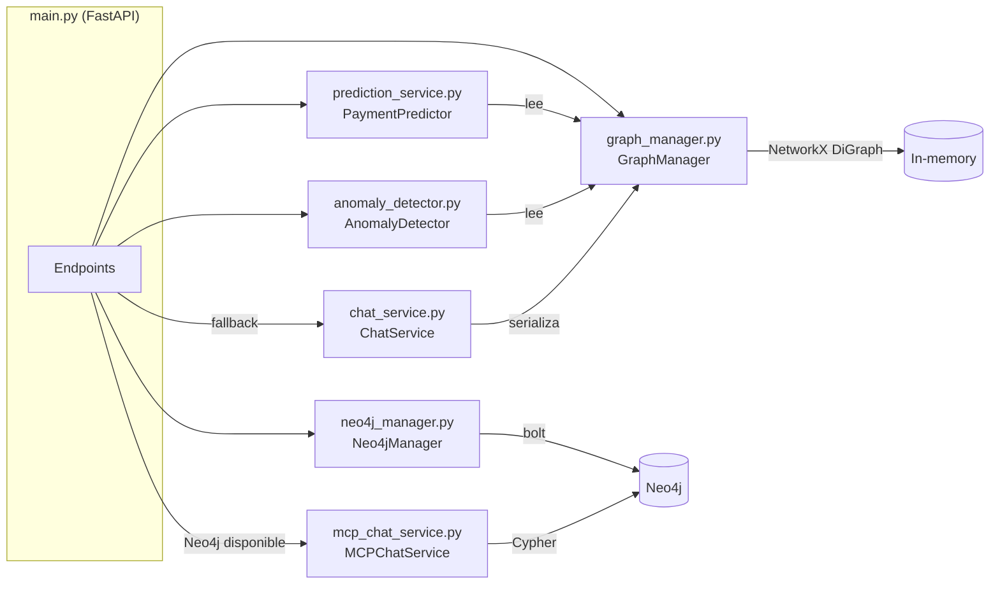

# Arquitectura del Backend — Analizador de Patrones de Llamadas

> Documentación técnica del backend FastAPI. Cubre módulos, flujo de datos, modelos ML, detección de anomalías e integración de chat con Gemini.

---

## Índice

1. [Vista de módulos](#1-vista-de-módulos)
2. [Flujo de datos](#2-flujo-de-datos)
3. [Módulos](#3-módulos)
   - [main.py](#mainpy)
   - [graph_manager.py](#graph_managerpy)
   - [prediction_service.py](#prediction_servicepy)
   - [anomaly_detector.py](#anomaly_detectorpy)
   - [chat_service.py](#chat_servicepy)
   - [mcp_chat_service.py](#mcp_chat_servicepy)
   - [neo4j_manager.py](#neo4j_managerpy)
4. [Endpoints](#4-endpoints)
5. [Variables de entorno](#5-variables-de-entorno)
6. [Decisiones de diseño](#6-decisiones-de-diseño)

---

## 1. Vista de módulos



Todos los módulos son instanciados como singletons a nivel de módulo en `main.py`. No hay inyección de dependencias — se pasan como argumentos a los métodos cuando es necesario (ej. `predictor.train(gm)`).

---

## 2. Flujo de datos

### 2.1 Ingesta

```
POST /ingest  (o auto-ingest en startup)
      │
      ▼
gm.reset()                          ← limpia NetworkX DiGraph y todos los dicts
      │
      ▼
gm.ingest(data)
  ├── _add_client()                 ← nodo "cliente" + nodo "deuda" + arista TIENE_DEUDA
  ├── _add_interaction()            ← iterado en orden cronológico por timestamp
  │     ├── pago_recibido           → nodo "pago" + arista REALIZA + acumula total_pagado
  │     ├── llamada_*               → nodo "interaccion" + aristas TUVO_INTERACCION, ATENDIDA_POR
  │     │     └── resultado=promesa_pago → nodo "promesa" + aristas GENERA, PROMETE
  │     └── email / sms             → nodo "contacto" + arista TUVO_CONTACTO
  │
  ├── _compute_promise_fulfillment()
  │     └── por cada promesa: compara pagos posteriores, marca cumplida/vencida,
  │         agrega arista SE_CUMPLE_CON al primer pago que la cumple
  │
  ├── _compute_client_metrics()
  │     └── calcula risk_score, estado, tasa_recuperacion, totales
  │
  └── _compute_agent_metrics()
        └── acumula contadores por resultado en el nodo agente

predictor.train(gm)                 ← extrae features de todos los clientes y entrena

neo4j_gm.ingest(data)               ← si conectado: replica la misma estructura en Neo4j
                                       con MERGE para idempotencia
```

### 2.2 Consulta (request típico)

```
GET /clientes/{id}/prediccion
      │
      ▼
predictor.predict(cliente_id)
  ├── _build_features(gm, cliente_id)   ← vector de 10 features
  └── _score(features)
        ├── LogisticRegression.predict_proba()   si >= 10 positivos en train
        └── suma ponderada + sigmoide             fallback heurístico
```

---

## 3. Módulos

### `main.py`

**Responsabilidad:** punto de entrada de FastAPI. Instancia todos los singletons, define el ciclo de vida del servidor y registra los endpoints.

**Singletons instanciados:**

| Variable | Tipo | Descripción |
|---|---|---|
| `gm` | `GraphManager` | Grafo NetworkX principal |
| `neo4j_gm` | `Neo4jManager` | Capa Neo4j |
| `predictor` | `PaymentPredictor` | Modelo de predicción |
| `anomaly_det` | `AnomalyDetector` | Detector de anomalías |
| `chat_service` | `ChatService` | Chat con contexto serializado |
| `mcp_chat` | `MCPChatService \| None` | Chat con Cypher; `None` si Neo4j no disponible |

**Startup (`@app.on_event("startup")`):**
1. Conecta Neo4j (`neo4j_gm.connect()`).
2. Intenta inicializar `MCPChatService`; si Neo4j no está disponible lo deja en `None`.
3. Si `data/interacciones_clientes.json` existe y tiene datos, ejecuta ingesta completa.

**Selección del servicio de chat en `/chat`:**
```python
active_service = mcp_chat if mcp_chat else chat_service
```
La respuesta incluye `"source": "mcp_cypher"` o `"source": "context_serialized"` para indicar cuál se usó.

**CORS:** configurado con `allow_origins=["*"]` — todos los orígenes permitidos.

---

### `graph_manager.py`

**Responsabilidad:** construcción y consulta del grafo de conocimiento NetworkX. Es el almacén analítico central del sistema.

**Constante:**
```python
REFERENCE_DATE = datetime(2025, 8, 12, tzinfo=timezone.utc)
```
Fecha de referencia para determinar si una promesa está vencida y para calcular días desde el último contacto en el predictor.

**Tipos de nodo:**

| `node_type` | Creado en |
|---|---|
| `cliente` | `_add_client()` |
| `deuda` | `_add_client()` |
| `interaccion` | `_add_interaction()` — tipos `llamada_saliente` / `llamada_entrante` |
| `pago` | `_add_interaction()` — tipo `pago_recibido` |
| `promesa` | `_add_interaction()` — cuando `resultado == "promesa_pago"` |
| `contacto` | `_add_interaction()` — tipos `email` / `sms` |
| `agente` | `_ensure_agent()` — creado lazy la primera vez que aparece un `agente_id` |

**Tipos de arista:**

| `edge_type` | Dirección |
|---|---|
| `TIENE_DEUDA` | `cliente → deuda` |
| `TUVO_INTERACCION` | `cliente → interaccion` |
| `REALIZA` | `cliente → pago` |
| `PROMETE` | `cliente → promesa` |
| `TUVO_CONTACTO` | `cliente → contacto` |
| `ATENDIDA_POR` | `interaccion → agente` |
| `GENERA` | `interaccion → promesa` |
| `SE_CUMPLE_CON` | `promesa → pago` (primer pago posterior que la cumple) |

**Lógica de cumplimiento de promesa (`_compute_promise_fulfillment`):**

Una promesa se marca `cumplida=True` si, entre los pagos realizados **después** del timestamp de la interacción que la generó, se cumple cualquiera de:
- Al menos un pago tiene `pago_completo=True`
- La suma acumulada de pagos posteriores >= 50% del `monto_prometido`

Una promesa se marca `vencida=True` si `fecha_promesa` < `REFERENCE_DATE`.

**Cálculo del risk score (`_compute_client_metrics`):**

```
risk = 50.0
risk += pagos_inmediatos * 5
risk -= se_niega * 8
risk -= disputas * 5
if promesas_hechas > 0:
    risk += (promesas_cumplidas / promesas_hechas) * 20 - 10
if total_pagado > 0:
    risk += min(total_pagado / monto_deuda, 1.0) * 15
if sentimientos.count("hostil") > 2:
    risk -= 10
risk = max(0, min(100, round(risk, 1)))
```

**Estados de cliente** (derivados del último evento):

`sin_contacto` → `contactado` → `promesa_activa` / `en_renegociacion` / `rehusa_pagar` / `en_disputa` / `sin_respuesta` / `pago_parcial` / `pago_completo`

**`get_graph_data()`:**
- Sin `cliente_id`: retorna solo nodos `cliente` y `agente`; las aristas cliente-agente se agregan con peso (número de interacciones).
- Con `cliente_id`: retorna ego-grafo de radio 2 con `nx.ego_graph()`, incluyendo todos los nodos vecinos.

---

### `prediction_service.py`

**Responsabilidad:** predecir la probabilidad de pago de un cliente en los próximos 7 días.

**Clase:** `PaymentPredictor`

**Estrategia de modelo:**
- Si hay >= 10 clientes con label positivo (pagos en los últimos 7 días respecto a `REFERENCE_DATE`): entrena `sklearn.linear_model.LogisticRegression(class_weight="balanced", max_iter=200, random_state=42)`.
- En caso contrario (o si scikit-learn falla): usa una heurística con pesos fijos.

**Label de entrenamiento (`_build_label`):** `1` si el cliente tiene al menos un pago con `timestamp >= REFERENCE_DATE - 7 días`; `0` en caso contrario.

**Features (10, normalizadas a [0, 1]):**

| # | Nombre | Descripción |
|---|---|---|
| 1 | `risk_score` | `risk_score / 100.0` |
| 2 | `tasa_promesas` | `promesas_cumplidas / promesas_hechas` |
| 3 | `promesas_hechas` | `min(promesas_hechas / 20.0, 1.0)` |
| 4 | `ratio_pagado_deuda` | `min(total_pagado / monto_deuda_inicial, 1.0)` |
| 5 | `ratio_pendiente_deuda` | `min(monto_pendiente / monto_deuda_inicial, 1.0)` |
| 6 | `dias_desde_ultimo_contacto` | `min(dias / 180.0, 1.0)`; 180 si no hay contacto |
| 7 | `total_interacciones` | `min(len(interactions) / 50.0, 1.0)` |
| 8 | `ratio_pagos_inmediatos` | `pagos_inmediatos / total_interacciones` |
| 9 | `tiene_promesa_activa` | `1.0` si hay promesa con `fecha_promesa > REFERENCE_DATE` y no cumplida |
| 10 | `estado_activo` | `1.0` si `cliente.estado == "activo"` |

**Pesos heurísticos (fallback):**

| Feature | Peso |
|---|---|
| `risk_score` | +0.40 |
| `tasa_promesas` | +0.30 |
| `ratio_pagos_inmediatos` | +0.20 |
| `tiene_promesa_activa` | +0.10 |
| `ratio_pagado_deuda` | +0.05 |
| `ratio_pendiente_deuda` | −0.05 |
| `dias_desde_ultimo_contacto` | −0.10 |
| `promesas_hechas`, `total_interacciones`, `estado_activo` | 0.00 |

**Scoring heurístico:** suma ponderada de features, clippeada a [−3, 3], normalizada linealmente a [0, 1]. No usa sigmoide.

**Respuesta de `predict()`:**
```json
{
  "cliente_id": "CLI-001",
  "probabilidad_pago_7d": 0.7231,
  "confianza": "alta",
  "factores_positivos": ["Risk score elevado", "Alta tasa de promesas cumplidas"],
  "factores_negativos": ["Días sin contacto elevado"],
  "modelo": "LogisticRegression",
  "fecha_prediccion": "2025-08-12"
}
```

`confianza` es `"alta"` si `prob > 0.7` o `prob < 0.3`; `"media"` en caso contrario.

---

### `anomaly_detector.py`

**Responsabilidad:** identificar patrones anómalos en el grafo de cobros.

**Clase:** `AnomalyDetector`

**Método principal:** `detect(gm, factor, threshold, days)` — ejecuta los 4 detectores en orden y asigna IDs secuenciales `ANO-001`, `ANO-002`, etc.

**Detectores:**

#### A — Agentes con alta tasa de disputas (`_detect_high_dispute_agents`)

Condición de alerta: agente con `total_contactos >= 5` y `tasa_disputas >= max(promedio_equipo, 0.01) * factor`.

- `factor` default: 3.0
- Severidad `"alta"` si `ratio_vs_promedio >= 3.0`; `"media"` en caso contrario.
- Resultados considerados disputa: `"disputa"`, `"disputa_abierta"`.

#### B — Clientes con promesas consecutivas rotas (`_detect_broken_promises`)

Condición de alerta: cliente con racha máxima de promesas `vencida=True AND cumplida=False` >= `threshold` (default 3).

- Las promesas se ordenan por `interaction_timestamp` antes de contar la racha.
- Una promesa cumplida rompe la racha; se mide la racha máxima, no la actual.
- Severidad `"alta"` si racha >= 5; `"media"` en caso contrario.

#### C — Agentes inactivos (`_detect_inactive_agents`)

Condición de alerta: agente sin interacciones en los últimos `days` días contados desde `REFERENCE_DATE` (o sin interacciones históricas).

- `days` default: 7
- Todos los casos detectados tienen severidad `"media"`.

#### D — Clientes con pagos estrictamente decrecientes (`_detect_decreasing_payments`)

Condición de alerta: cliente con >= 3 pagos donde los últimos 3 montos son estrictamente decrecientes (`montos[-3] > montos[-2] > montos[-1]`).

- Severidad `"alta"` si `ultimo_monto / primer_monto_historico < 0.5`.
- Severidad `"media"` en caso contrario.

**Estructura de cada anomalía retornada:**
```json
{
  "id": "ANO-001",
  "tipo": "agente_disputas_alto | cliente_promesas_rotas | agente_inactivo | cliente_pagos_decrecientes",
  "severidad": "alta | media",
  "entidad_tipo": "agente | cliente",
  "entidad_id": "...",
  "descripcion": "Texto legible con valores reales",
  "datos": { ... },
  "recomendacion": "Acción sugerida"
}
```

---

### `chat_service.py`

**Responsabilidad:** asistente conversacional Gemini sin acceso directo a Neo4j. El contexto completo se serializa como texto y se inyecta al inicio de cada conversación.

**Clase:** `ChatService`

**Modelo:** `gemini-2.5-flash` · `temperature=0.3`

**`build_context(dashboard, agents, clients, promises)`:** serializa todos los datos del grafo como texto estructurado: métricas generales, distribución de riesgo, deuda por tipo, resultados de interacciones, todos los agentes y todos los clientes. Si hay promesas vencidas, incluye hasta 20.

**`chat(message, context, history)`:** construye la lista `contents` de la siguiente forma:
1. Contexto serializado como primer turno `user`.
2. Confirmación del modelo como primer turno `model`.
3. Historial previo (últimos 10 turnos).
4. Mensaje actual del usuario.

Llama a `client.aio.models.generate_content()` con el sistema de instrucciones `SYSTEM_PROMPT`.

**Manejo de errores:** captura `RESOURCE_EXHAUSTED` (429) y `UNAVAILABLE` (503) con mensajes específicos en español.

---

### `mcp_chat_service.py`

**Responsabilidad:** asistente conversacional Gemini con acceso dinámico a Neo4j mediante function calling. En lugar de serializar todos los datos, el LLM genera consultas Cypher en tiempo real.

**Clase:** `MCPChatService`

**Modelo:** `gemini-2.5-flash` · `temperature=0.2`

**Activación:** se instancia en startup solo si `NEO4J_PASSWORD` está configurada y Neo4j responde en <= 6 segundos.

**Herramientas expuestas al LLM (function declarations):**

| Función | Descripción |
|---|---|
| `ejecutar_cypher` | Ejecuta una query Cypher de solo lectura. Parámetro: `query` (string) |
| `obtener_metricas_generales` | Retorna totales de clientes, deuda, recuperado y tasa de recuperación desde Neo4j. Sin parámetros |

**Guardrails de seguridad (`_is_safe_cypher`):**

Rechaza queries que contengan (case-insensitive):
`CREATE`, `MERGE`, `DELETE`, `DETACH`, `SET`, `REMOVE`, `DROP`, `CALL { ... WRITE`, `LOAD CSV`

Si la query no incluye `LIMIT`, se agrega `LIMIT 50` automáticamente.

Timeout por query: 10 segundos.

**Loop agentico:** máximo 4 rondas de tool calls. Si el LLM no produce texto en ese límite, retorna un mensaje de error.

**`build_context()`:** a diferencia de `ChatService`, retorna solo un resumen mínimo (4 métricas) ya que el LLM puede consultar datos específicos directamente.

**Serialización de nodos Neo4j:** los objetos nodo retornados por el driver se detectan por `hasattr(v, '_properties')` y se convierten a `dict`.

---

### `neo4j_manager.py`

**Responsabilidad:** capa de persistencia en Neo4j. Replica el mismo grafo que NetworkX pero en una base de datos durable.

**Clase:** `Neo4jManager`

**Driver:** `neo4j.AsyncGraphDatabase` (async). Timeout de conexión TCP: 5 s. Timeout de verificación en startup: 6 s.

**Constraints creados al conectar:**

```cypher
CREATE CONSTRAINT cliente_id    IF NOT EXISTS FOR (c:Cliente)     REQUIRE c.id IS UNIQUE
CREATE CONSTRAINT agente_id     IF NOT EXISTS FOR (a:Agente)      REQUIRE a.id IS UNIQUE
CREATE CONSTRAINT interaccion_id IF NOT EXISTS FOR (i:Interaccion) REQUIRE i.id IS UNIQUE
CREATE CONSTRAINT pago_id       IF NOT EXISTS FOR (p:Pago)        REQUIRE p.id IS UNIQUE
CREATE CONSTRAINT promesa_id    IF NOT EXISTS FOR (pr:PromesaPago) REQUIRE pr.id IS UNIQUE
```

**`ingest(data)`:** limpia el grafo completo (`MATCH (n) DETACH DELETE n`) y recrea todos los nodos usando `MERGE` para idempotencia. Procesa en el orden: clientes/deudas → interacciones (pagos, llamadas con promesas, contactos).

**Diferencia vs. `GraphManager`:** `Neo4jManager` no ejecuta los tres pasos de post-procesamiento (cumplimiento de promesas, métricas de clientes, métricas de agentes). Las propiedades derivadas como `risk_score` y `cumplida` no se escriben en Neo4j durante la ingesta inicial.

> ⚠️ Nota: la query de `get_unfulfilled_promises()` filtra con `fecha_promesa < '2025-08-12'` hardcodeada como string, en lugar de usar `REFERENCE_DATE`. Si la fecha de referencia cambia en `graph_manager.py`, esta query no se actualizará automáticamente.

**Consultas analíticas disponibles:**

| Método | Descripción |
|---|---|
| `get_dashboard_data()` | KPIs agregados: clientes, deuda, recuperado, agentes, interacciones, promesas |
| `get_client_timeline(id)` | Interacciones, pagos y promesas de un cliente |
| `get_agent_effectiveness(id)` | Conteo de resultados y tasa de éxito de un agente |
| `get_unfulfilled_promises()` | Promesas con `fecha_promesa < '2025-08-12'` y `cumplida = false` |
| `get_graph_stats()` | Conteo de nodos por etiqueta (usado en `GET /`) |

---

## 4. Endpoints

Referencia completa en `GET /docs` (Swagger UI generado por FastAPI).

| Tag | Método | Ruta | Handler |
|---|---|---|---|
| Health | GET | `/` | `root()` |
| Data | POST | `/ingest` | `ingest_data()` |
| Chat | POST | `/chat` | `chat_endpoint()` |
| Clientes | GET | `/clientes` | `list_clients()` |
| Clientes | GET | `/clientes/{id}` | `get_client()` |
| Clientes | GET | `/clientes/{id}/timeline` | `client_timeline()` |
| Clientes | GET | `/clientes/{id}/prediccion` | `get_prediccion()` |
| Agentes | GET | `/agentes` | `list_agents()` |
| Agentes | GET | `/agentes/{id}/efectividad` | `agent_effectiveness()` |
| Analytics | GET | `/analytics/dashboard` | `dashboard()` |
| Analytics | GET | `/analytics/promesas-incumplidas` | `unfulfilled_promises()` |
| Analytics | GET | `/analytics/mejores-horarios` | `best_hours()` |
| Analytics | GET | `/analytics/anomalias` | `get_anomalias()` |
| Graph | GET | `/graph/data` | `graph_data()` |

---

## 5. Variables de entorno

| Variable | Módulo que la lee | Efecto si no está definida |
|---|---|---|
| `GEMINI_API_KEY` | `main.py` → `ChatService`, `MCPChatService` | `client = None`; `/chat` retorna error |
| `NEO4J_URI` | `neo4j_manager.py`, `mcp_chat_service.py` | Usa default `bolt://localhost:7687` |
| `NEO4J_USER` | `neo4j_manager.py`, `mcp_chat_service.py` | Usa default `neo4j` |
| `NEO4J_PASSWORD` | `neo4j_manager.py`, `mcp_chat_service.py` | El sistema opera en modo solo-NetworkX; `mcp_chat` permanece `None` |

---

## 6. Decisiones de diseño

### Grafo dual: NetworkX + Neo4j

NetworkX opera en RAM con latencia sub-milisegundo y no requiere infraestructura adicional. Neo4j es opcional: habilita persistencia durable, el modo de chat con Cypher dinámico y la exploración visual desde Neo4j Browser (`http://localhost:7474`). El sistema funciona completamente sin Neo4j.

### REFERENCE_DATE fija (2025-08-12)

La fecha de referencia está hardcodeada porque corresponde a la fecha de generación del dataset de prueba. Las promesas se clasifican como vencidas o activas relativas a esa fecha, y el predictor calcula "últimos 7 días" también desde ese punto. Si se usa el sistema con datos en tiempo real, esta constante debe reemplazarse por `datetime.now(timezone.utc)`.

### Predictor: LogisticRegression como primer intento, heurística como fallback

Con datasets pequeños (< 10 clientes con pagos recientes), `LogisticRegression` no puede aprender patrones confiables. La heurística con pesos fijos documentados es más transparente y predecible en esos casos. Ambos modelos producen una probabilidad en [0, 1] con la misma interfaz.

### MCPChatService: loop agentico con límite de 4 rondas

El LLM puede necesitar múltiples consultas Cypher para responder una pregunta compleja (ej. primero busca el cliente, luego sus pagos, luego sus promesas). El límite de 4 rondas evita loops infinitos ante consultas ambiguas.

### Ingesta síncrona en `/ingest`

La ingesta de NetworkX (`gm.ingest()`) es síncrona y en memoria. Con el dataset de prueba (~50 clientes, ~500 interacciones) la operación completa toma < 100 ms. La ingesta en Neo4j es async y se ejecuta en el mismo request; con datasets grandes esto podría convertirse en un cuello de botella.

### Agregación de aristas cliente-agente en `get_graph_data()`

En la vista de grafo completo (sin `cliente_id`), las aristas entre clientes y agentes se agregan con un peso que representa el número de interacciones entre ellos. Esto evita saturar el canvas de Cytoscape.js con cientos de aristas individuales cuando hay muchas interacciones.
